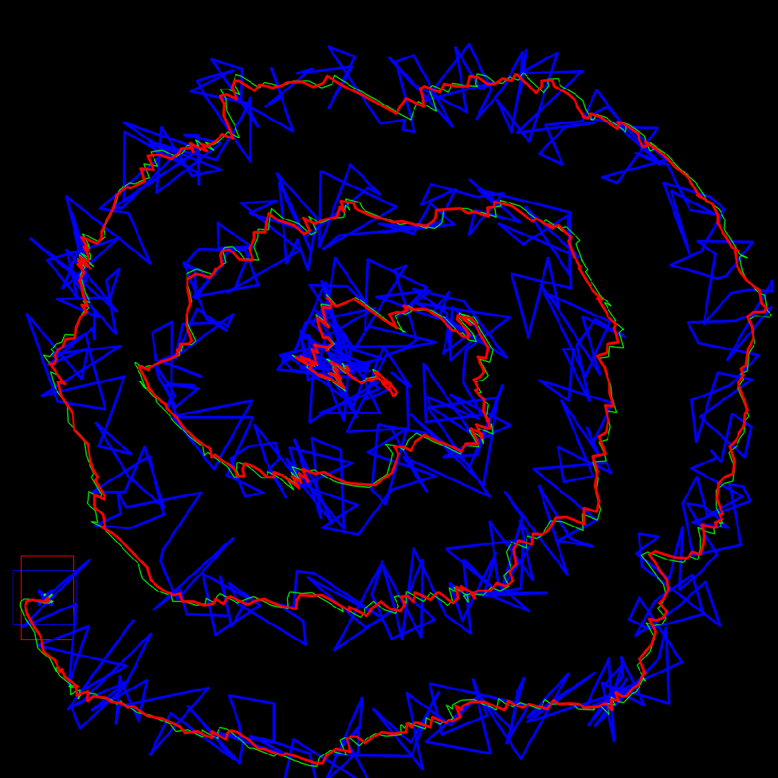

# UnscentedKalmanFilterCA
Unscented Kalman Filter with [uniform acceleration](https://en.wikipedia.org/wiki/Acceleration#Uniform_acceleration) kinematic model.
Used UKF from the [opencv_contrib](https://github.com/opencv/opencv_contrib) tracking library.

Demonstration of filtering the estimate of the centroid and rectangle with hard noise:

  

